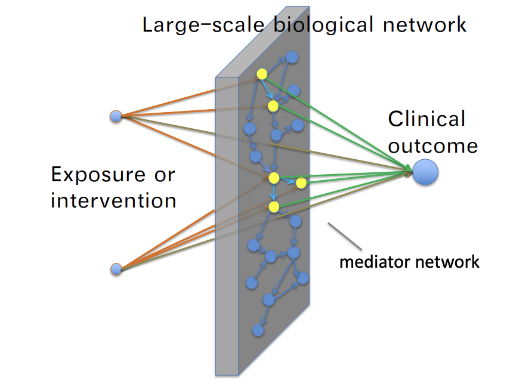

# medNet
## A New Framework for Exploratory Network Mediator Analysis in Omics Data

We propose a new framework for predictive mediation analysis that can handle tens of thousands can-
didate mediators, model nonlinear relations, and incorporate existing knowledge. The goal of our method is to sensitively detect potential mediators and mediator networks, which can be validated by further experiments.Instead of using the traditional mediation model which is very rigid, we focus on the prediction accuracy estimated by cross-validation as a criterion for mediator selection. medNet is implemented as an open-source R package.

Installation
------------
You can install the released version of medNet from Github with the following code.
## Dependencies 
* R version >= 4.1.0.
* R packages: grDevices, igraph, abind, caret, doParallel,
        e1071, energy, foreach, igraph, parallel, pROC, randomForest, foreach, doParallel, parallel, doRNG

```{r}
# install devtools if necessary
install.packages('devtools')

# install the medNet package
devtools::install_github('EddieFua/medNet')

# load package
library(medNet)

```

## Example
This example is used to reproduce the experimental results of METABRIC dataset

```{r}
library(medNet)
load('~/data/METABRIC/Clean data/cleandata.RData')
res = findGlobalNet(response = dat$response,mediator = dat$mediator,exposure = dat$exposure, mediator.network = dat$mediator_network, H=17,T = 0.6)
```
### findGlobalNet: Find predictive network for all exposures
### Args:
Find predictive network for all exposures
- **response**: A binary vector whose length is \(n\) (the number of samples).
- **exposure**: A matrix with dimensions \(n \times p\), where \(n\) is the number of samples, and \(p\) is the number of exposures.
- **mediator**: A matrix with dimensions \(n \times q\), where \(n\) is the number of samples, and \(q\) is the number of mediators.
- **mediator.network**: A matrix with dimensions \(m \times 2\), where \(m\) is the number of edges in the candidate network. Each element in this matrix corresponds to the column number of the mediator.
- **covariate**: Data.frame whose rows refer to observations and columns refer to each possible covariate.
- **repeat.times**: Number of repeated cross-validations.
- **fold.number**: Number of folds used in cross-validation.
- **T**: Threshold used to determine predictivity in each repeat.
- **H**: Threshold used to determine predictivity overall repeats.
- **method**: Model used, where:
  - `LR` refers to logistic regression,
  - `RF` refers to random forest,
  - `SVM` refers to support vector machine.
- **directed**: Boolean variable indicating whether the mediator.network is directed.
- **parallelization**: Boolean variable indicating whether to do parallelization in processing data.
- **thread**: The number of threads used for parallelization computation.

### Returns:
- **result**: A list containing the symbolic edges list, undirected network object, and the corresponding final AUC.

### evalGlobalNet: Evaluate the AUC of the global network.

### Args:
- **final_net**: Data.frame of the symbolic edges list.
- **response**: Binary numeric vector indicating classifications.
- **exposure**: Data.frame whose rows refer to observations and columns refer to each possible exposure.
- **mediator**: Data.frame whose rows refer to observations and columns refer to each possible mediator.
- **test.index**: List of index of test observations for each repeat time.
- **covariate**: Data.frame whose rows refer to observations and columns refer to each possible covariate.
- **T**: Threshold used to determine predictivity in each repeat time.
- **H**: Threshold used to determine predictivity over all repeats.
- **method**: Model used, where:
  - `LR` refers to logistic regression,
  - `RF` refers to random forest,
  - `SVM` refers to support vector machine.

### Returns:
- **auc**: Estimated AUC of the network.

### findPredEdge: Find Predictive Mediators

### Args:
- **response**: Binary numeric vector indicating classifications.
- **exposure**: Data.frame whose rows refer to observations and columns refer to each possible exposure.
- **mediator**: Data.frame whose rows refer to observations and columns refer to each possible mediator.
- **test.index**: List of index of test observations for each repeat time.
- **covariate** (optional): Data.frame whose rows refer to observations and columns refer to each possible covariate. Default is `FALSE`.
- **T**: Threshold used to determine predictivity in each repeat time. Default is `0.6`.
- **H**: Threshold used to determine predictivity over all repeats. Default is `14`.
- **method**: Model used, where:
  - `LR` refers to logistic regression,
  - `RF` refers to random forest,
  - `SVM` refers to support vector machine.
- **parallization**: Boolean variable indicating whether to do parallelization in processing data. Default is `TRUE`.
- **thread**: The number of threads used for parallelization computation, defaulting to half the number of available cores detected.

### Returns:
- **result**: A list containing all predictive edges with their corresponding AUC values.

### findSingleNet: Find Predictive Network for Single Exposure

### Args:
- **response**: Binary numeric vector indicating classifications.
- **single.exposure**: List containing information about a single predictive exposure and its predictive mediators.
- **mediator**: Data.frame whose rows refer to observations and columns refer to each possible mediator.
- **mediator.network**: Data.frame representing an undirected network chart, where each row corresponds to a functional link.
- **test.index**: List of indices for test observations for each repeat time.
- **covariate** (optional): Data.frame whose rows refer to observations and columns refer to each possible covariate. Default is `FALSE`.
- **T**: Threshold used to determine predictivity in each repeat time. Default is `0.6`.
- **H**: Threshold used to determine predictivity over all repeats. Default is `14`.
- **method**: Model used, where:
  - `LR` refers to logistic regression,
  - `RF` refers to random forest,
  - `SVM` refers to support vector machine.

### Returns:
- **result**: A list containing all mediation links and functional links associated with a single exposure.


